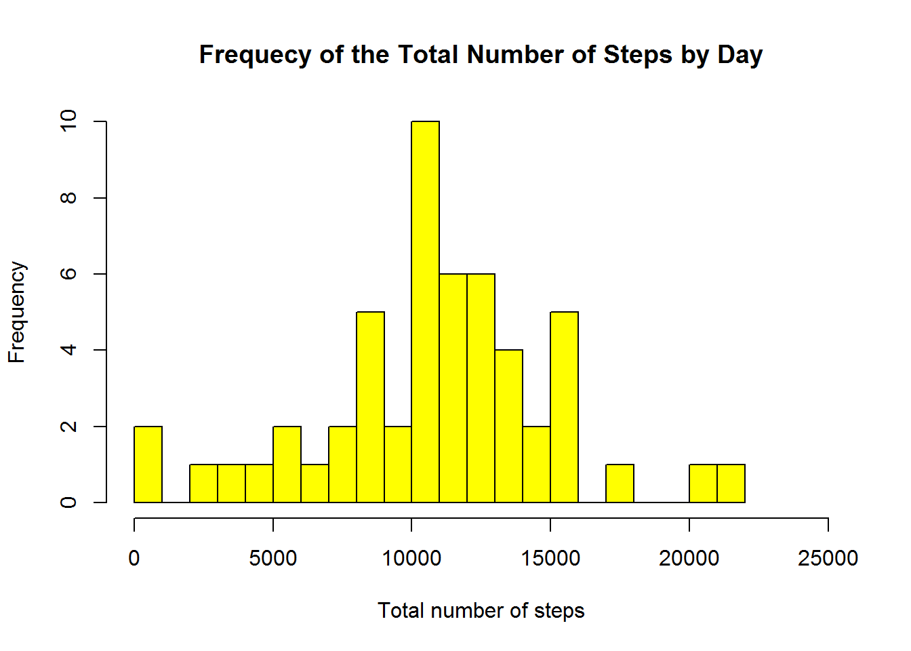
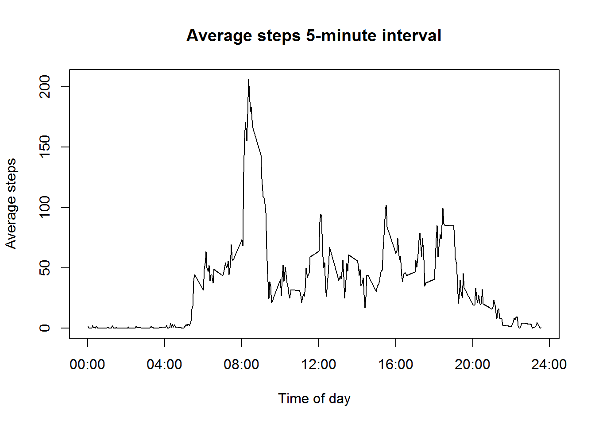
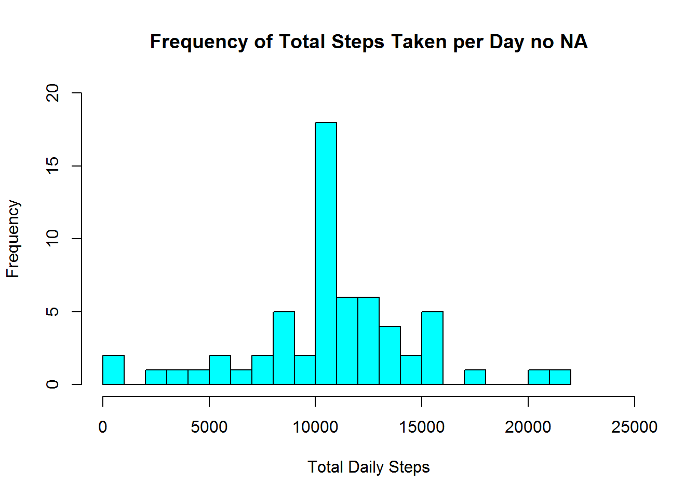
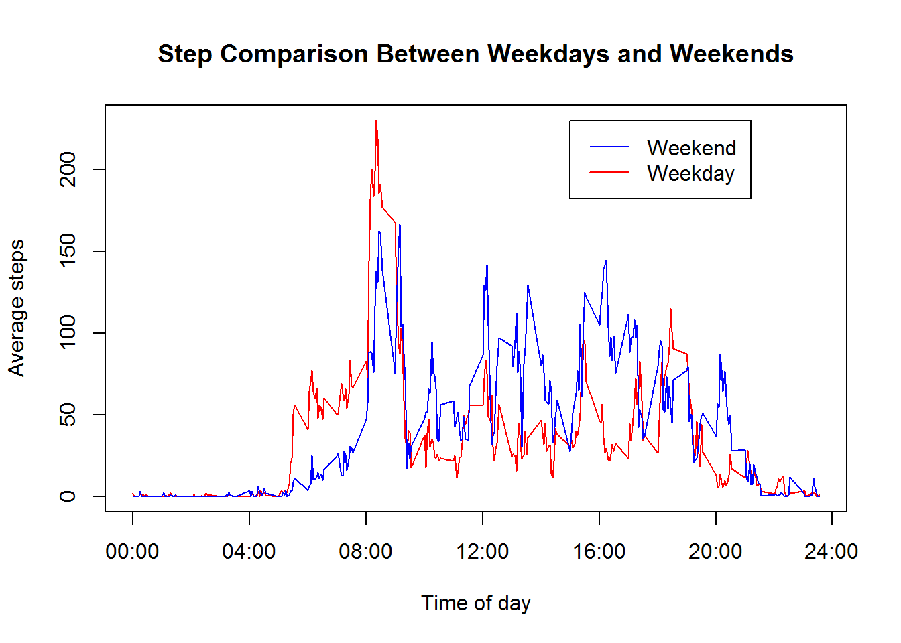

This markdown document contains the completed analysis and code for the Week 1 Peer Assessment project for the Reproducible Research course.  A desciption of the data, analysis, and the results are below.

#The Data

**Source** 

https://d396qusza40orc.cloudfront.net/repdata%2Fdata%2Factivity.zip

**Date and Time Accessed** 

January 10th, 2016 2:24 PM

**Description**

It is now possible to collect a large amount of data about personal movement using activity monitoring devices such as a Fitbit, Nike Fuelband, or Jawbone Up. These type of devices are part of the "quantified self" movement -- a group of enthusiasts who take measurements about themselves regularly to improve their health, to find patterns in their behavior, or because they are tech geeks. But these data remain under-utilized both because the raw data are hard to obtain and there is a lack of statistical methods and software for processing and interpreting the data.

This assignment makes use of data from a personal activity monitoring device. This device collects data at 5 minute intervals through out the day. The data consists of two months of data from an anonymous individual collected during the months of October and November, 2012 and include the number of steps taken in 5 minute intervals each day.

**Variables**

*Please note some values for these variables are missing.  We'll address this later in the document.*

1. steps: Number of steps taking in a 5-minute interval (missing values are coded as NA)

2. date: The date on which the measurement was taken in YYYY-MM-DD format

3. interval: Identifier for the 5-minute interval in which measurement was taken

#Loading and preprocessing the data
First, to ensure the environment is clean we run the below R code to clear the environment.


```r
rm(list=ls(all=TRUE)) 
```

Next, we'll load the data with R and a temp file.


```r
#Create a temp file for the zip file
temp <- tempfile()

#Load zip into temp
download.file("https://d396qusza40orc.cloudfront.net/repdata%2Fdata%2Factivity.zip",temp)

#Read the activity.csv file in the downloaded zip file
actraw <- read.csv(unz(temp,"activity.csv"))

#Remove the temp file
rm("temp")
```

The data form the CSV file now resides in the "actraw" variable.

#What is mean total number of steps taken per day?

###Make a histogram of the total number of steps taken each day
We can now create a histogram based on our data for the frequency of the number of steps per day.


```r
#Create the histogram
hist(tapply(actraw$steps, actraw$date, sum), breaks=20, main="Frequecy of the Total Number of Steps by Day", xlab="Total number of steps", xlim=c(0,25000), col="yellow")
```



###Calculate and report the mean and median total number of steps taken per day

For this we'll need to sum the number of steps by day, and then use the resulting dataset to determine the mean and median.


```r
#Sum by day and convert to numeric
daily_steps <- as.numeric(tapply(actraw$steps, actraw$date, sum))

#Calculate the Mean and Median and round to nearest whole number
daily_mean <- round(mean(daily_steps, na.rm=TRUE))
daily_median <- round(median(daily_steps, na.rm=TRUE))
daily_mean
```

```
## [1] 10766
```

```r
daily_median
```

```
## [1] 10765
```

#What is the average daily activity pattern?

###Make a time series plot (i.e. type = "l") of the 5-minute interval (x-axis) and the average number of steps taken, averaged across all days (y-axis)

For this question we'll create a data frame for the data, and use plot to display the results.


```r
#Create a factor on interval so we can use it in a data frame shortly
actraw$interval <- as.factor(as.character(actraw$interval))

#Calculate the mean and remove all NA values
interval_mean <- as.numeric(tapply(actraw$steps, actraw$interval, mean, na.rm=TRUE))

#Create a dataframe based on interval_mean using the interval factor
interval_data <- data.frame(intervals = as.numeric(levels(actraw$interval)), interval_mean)

#Make sure the data is in the correct order
interval_data <- interval_data[order(interval_data$intervals),]

#Create the plot and add an axis label for clarity
plot(interval_data$intervals, interval_data$interval_mean, type = "l", main = "Average steps 5-minute interval", ylab = "Average steps", xlab = "Time of day", xaxt = "n")
axis(side = 1, at = seq(0, 2400,400), labels = c("00:00", "04:00", "08:00", "12:00", "16:00","20:00","24:00"))
```



###Which 5-minute interval, on average across all the days in the dataset, contains the maximum number of steps?

To determine this we can use the data frame we created, change the sort to descending based on the mean, and then display the first value.


```r
#Sort the mean interval data by descending order
interval_desc <- interval_data[order(interval_data$interval_mean, decreasing = TRUE),]

#Get the top values
head(interval_desc, 1)
```

```
##     intervals interval_mean
## 272       835      206.1698
```

#Imputing missing values

###Calculate and report the total number of missing values in the dataset (i.e. the total number of rows with NAs)

For this requirement we can use the DIM function to quickly go through our raw data and determine how many values are set to NA


```r
#Dim to determine NA count
dim(actraw[is.na(actraw$steps),])[1]
```

```
## [1] 2304
```

###Devise a strategy for filling in all of the missing values in the dataset. The strategy does not need to be sophisticated. For example, you could use the mean/median for that day, or the mean for that 5-minute interval, etc.

The strategy we'll use to fill in the missing values will be to use the average for that specific interval based on the complete data.  This should give us a close approximation as to what would have actually occurred.

###Create a new dataset that is equal to the original dataset but with the missing data filled in.

The below code will create a new dataset, act_nona, based on the strategy above.


```r
#Create a loop to go through and update all the NA values 
steps <- vector()
for (i in 1:dim(actraw)[1]) {
    if (is.na(actraw$steps[i])) {
        steps <- c(steps, interval_data$interval_mean[interval_data$intervals == actraw$interval[i]])
    } else {
        steps <- c(steps, actraw$steps[i])
    }
}


act_nona <- data.frame(steps = steps, date = actraw$date, interval = actraw$interval)
```

###Make a histogram of the total number of steps taken each day and Calculate and report the mean and median total number of steps taken per day. Do these values differ from the estimates from the first part of the assignment? What is the impact of imputing missing data on the estimates of the total daily number of steps?


```r
#create the histogram
hist(tapply(act_nona$steps, act_nona$date, sum), xlab = "Total Daily Steps", breaks = 20, main = "Frequency of Total Steps Taken per Day no NA", xlim = c(0,25000), ylim = c(0,20), col = "cyan")
```




```r
#Sum by day and convert to numeric
daily_steps_v2 <- as.numeric(tapply(act_nona$steps, act_nona$date, sum))

#Calculate the Mean and Median and round to nearest whole number
daily_mean <- round(mean(daily_steps_v2, na.rm=TRUE))
daily_median <- round(median(daily_steps_v2, na.rm=TRUE))
daily_mean
```

```
## [1] 10766
```

```r
daily_median
```

```
## [1] 10766
```

The Mean and Median are displayed and both should be 10,766. There is little impact to the mean and median, and only a slight impact to the histogram when imputing the missing data.  The histograms are still very similar and we do see an increase in the number of times the average is hit.  The overall distribution is the same though. Due to the method we chose the numbers won't change drastically as we're using averages.

#Are there differences in activity patterns between weekdays and weekends?

For this part the weekdays() function may be of some help here. Use the dataset with the filled-in missing values for this part.

###Create a new factor variable in the dataset with two levels - "weekday" and "weekend" indicating whether a given date is a weekday or weekend day.

We'll add the day type based on the date column, and then create the factor as we did before.


```r
#Adding the day_type and making it a factor
act_nona$day_type <- c("weekend", "weekday", "weekday", "weekday", "weekday", "weekday", "weekend")[as.POSIXlt(act_nona$date)$wday + 1]
act_nona$day_type <- as.factor(act_nona$day_type)

weekday <- act_nona[act_nona$day_type == "weekday", ]
weekend <- act_nona[act_nona$day_type == "weekend", ]
weekday_means <- as.numeric(tapply(weekday$steps, weekday$interval, mean))
weekend_means <- as.numeric(tapply(weekend$steps, weekend$interval, mean))

#Creating the dataframe with both types
intervals_dt <- data.frame(intervals = as.numeric(levels(actraw$interval)), weekday_means, weekend_means)

#ordering the dataframe
intervals_dt <- intervals_dt[order(intervals_dt$intervals),  ]
```


###Make a panel plot containing a time series plot (i.e. type = "l") of the 5-minute interval (x-axis) and the average number of steps taken, averaged across all weekday days or weekend days (y-axis). See the README file in the GitHub repository to see an example of what this plot should look like using simulated data.

I combined the weekday and weekends into a single plot as this question is designed as a comparison.  Although you can compare two seperate plots like in the ReadMe file, it is a bit easier when they are on the same plot.


```r
#Creating a plot for the Weekday and Weekend comparison
plot(intervals_dt$intervals, intervals_dt$weekday_means, type = "l", col = "red", ylab = "Average steps", xlab = "Time of day", main = "Step Comparison Between Weekdays and Weekends", xaxt = "n")
axis(side = 1, at = seq(0, 2400,400), labels = c("00:00", "04:00", "08:00", "12:00", "16:00","20:00","24:00"))
lines(intervals_dt$intervals, intervals_dt$weekend_means, type = "l", col = "blue")
legend(1500, 230, c("Weekend", "Weekday "), lty = c(1, 1), lwd = c(1, 1), col = c("blue", "red"))
```



